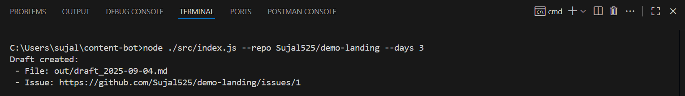
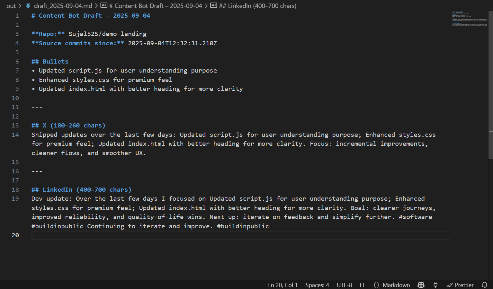
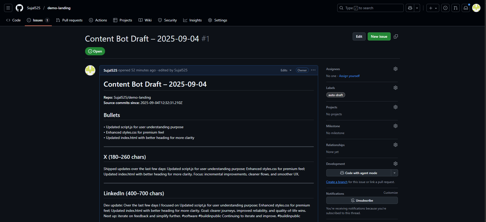

# 📢 Content Bot

A CLI tool that turns recent **GitHub commits** into **social media draft posts** (X + LinkedIn).  


## 🚀 Setup

### 1. Clone this repo
```
git clone https://github.com/Sujal525/content-bot.git
cd content-bot
```
### 2. Install dependencies
```
npm install
```

### 3. Create .env
```
Copy the example:
cp .env.example .env
Edit .env with:

# Required (classic token with repo scope)
GITHUB_TOKEN=ghp_yourGitHubTokenHere

# Optional (for better summaries; fallback template used if empty)
OPENAI_API_KEY=sk_yourOpenAIKeyHere

# Optional: anonymize these words to "customer"
CLIENT_WORDS=Acme,Contoso,Globex
```

### 4. Run the bot
```
node ./src/index.js --repo yourusername/yourreponame --days 3
```

### 5. Example output:
```
Draft created:
 - File: out/draft_2025-09-04.md
 - Issue: https://github.com/yourusername/yourreponame/issues/1

📁 Project Structure
content-bot/
├─ src/
│  ├─ index.js        # CLI entry
│  ├─ github.js       # GitHub API helpers
│  ├─ generate.js     # Draft generation (AI or fallback)
│  ├─ sanitize.js     # Strips secrets & client names
│  ├─ state.js        # Tracks last run time
│  ├─ utils.js        # Helpers
├─ out/               # Generated drafts
│  └─ draft_YYYY-MM-DD.md
├─ state.json         # Auto-generated (tracks last run)
├─ .env.example       # Example env file
├─ .gitignore
├─ package.json
└─ README.md
```


#### SUBMISSION NOTES

### 1.REPO LINK:
```
https://github.com/Sujal525/content-bot
```
### 2. DEMO REPO TESTED:
```
https://github.com/Sujal525/demo-landing
```

### 3.SCREENSHOTS:
```
## 1. Terminal run


## 2. Draft file


## 3. GitHub Issue created


```
